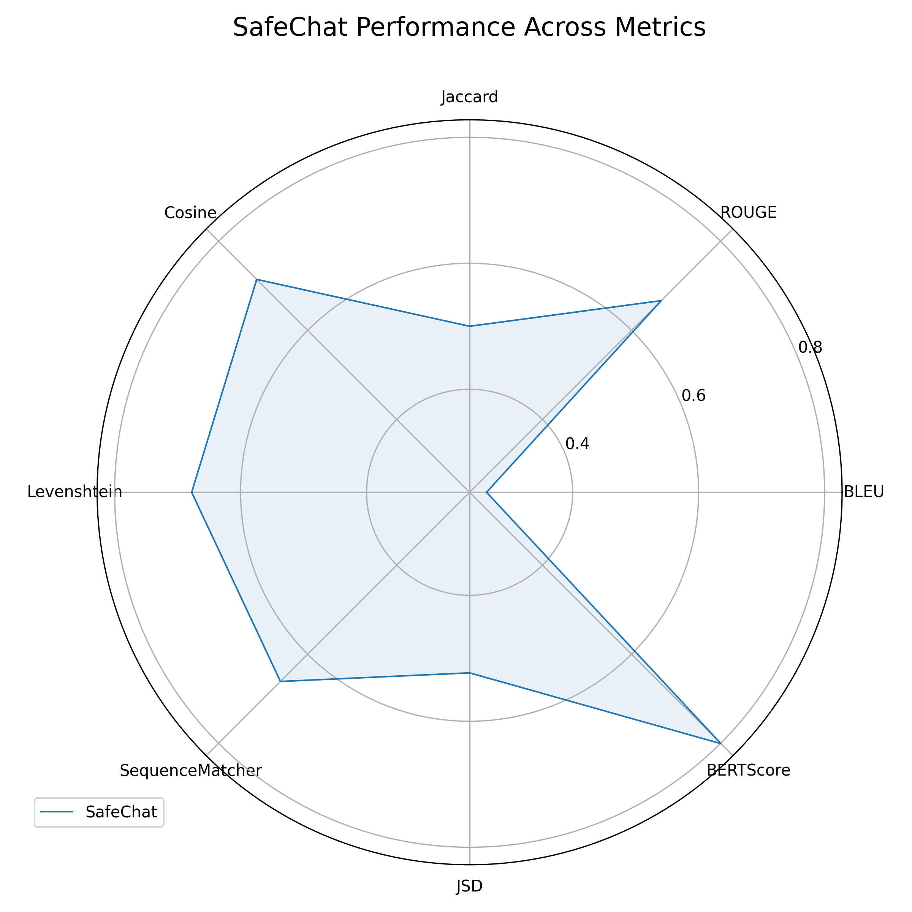
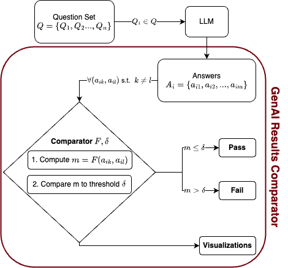

# GAICo: GenAI Results Comparator

_GAICo_ is a Python library providing evaluation metrics to compare generated texts, particularly useful for outputs from Large Language Models (LLMs), often against reference or ground truth texts.

## Quick Start

GAICo makes it easy to evaluate and compare LLM outputs. For detailed, runnable examples, please refer to our Jupyter Notebooks in the [`examples/`](examples/) folder:
-   [`quickstart-1.ipynb`](examples/quickstart-1.ipynb): Focuses on comparing **multiple model outputs** using a **single metric**.
-   [`quickstart-2.ipynb`](examples/quickstart-2.ipynb): Demonstrates evaluating a **single model output** across **all available metrics**.

Here’s a glimpse of GAICo's capabilities:

**1. Comparing Multiple Models with a Single Metric**

This scenario involves evaluating responses from different models against a common `reference_answer` using a metric like `JaccardSimilarity`.

```python
# Assumption: GAICo imports ✅

# llm_responses = {
#   "LLM_A": "Response from Model A...",
#   "LLM_B": "Response from Model B..."
# }
# reference_answer = "The ideal reference text."

# generated_texts = list(llm_responses.values())
# e.g., ["Response from Model A...", "Response from Model B..."]

# 1. Calculate Scores
metric = JaccardSimilarity()
scores = metric.calculate(generated_texts, reference_answer)
# Output Jaccard scores (example):
# `scores` (for LLM_A, LLM_B): [0.3529, 0.6250]

# 2. Apply Thresholds
# Prepare input for batch thresholding: list of dicts like [{"Jaccard": score_A}, {"Jaccard": score_B}]
threshold_input = [{"Jaccard": s} for s in scores]
results_with_thresholds = apply_thresholds(threshold_input)
# For LLM_A result might be:
# `results_with_thresholds[0]['Jaccard']`:
# {'score': 0.3529, 'threshold_applied': 0.5, 'passed_threshold': False}

# 3. Visualize & Report
# The full quickstart notebooks show how to use:
# - `prepare_results_dataframe(...)` to structure data.
# - `plot_metric_comparison(...)` to generate a bar chart comparing LLM_A and LLM_B.
# - `generate_deltas_csv(...)` to create a detailed CSV report with texts, scores, and pass/fail status.
```

_This workflow template helps you quickly assess multiple LLMs. See [examples/quickstart-1.ipynb](examples/quickstart-1.ipynb) for the full code, data setup, and how to generate comparison bar plots and CSV reports._

**2. Evaluating a Single Model with Multiple Metrics**

Along with following the template above, GAICo also excels at providing a holistic view of a single model's performance across a comprehensive suite of metrics. This is often best visualized with a radar chart.

<p align="center">
  
  <br/><em>Example Radar Chart generated by <code>examples/quickstart-2.ipynb</code>.</em>
</p>

_The [examples/quickstart-2.ipynb](examples/quickstart-2.ipynb) notebook demonstrates how to calculate all available metrics (BLEU, ROUGE, BERTScore, Cosine Similarity, etc.) for a single generated text against its reference and then use <code>plot_radar_comparison</code> to create visualizations like the one above._

## Description

The library provides a set of metrics for evaluating **2 text strings as inputs**. **Outputs are on a scale of 0 to 1** (normalized), where 1 indicates a perfect match between the two texts.

**_Class Structure:_** All metrics are implemented as classes, and they can be easily extended to add new metrics. The metrics start with the `BaseMetric` class under the `gaico/base.py` file.

Each metric class inherits from this base class and is implemented with **just one required method**: `calculate()`.

This `calculate()` method takes two parameters:

- `generated_texts`: Either a string or a Iterables of strings representing the texts generated by an LLM.
- `reference_texts`: Either a string or a Iterables of strings representing the expected or reference texts.

If the inputs are Iterables (lists, Numpy arrays, etc.), then the method assumes that there exists a one-to-one mapping between the generated texts and reference texts, meaning that the first generated text corresponds to the first reference text, and so on.

**_Note:_** While the library can be used to compare strings, it's main purpose is to aid with comparing results from various LLMs.

**_Inspiration_** for the library and evaluation metrics was taken from [Microsoft's
article on evaluating LLM-generated content](https://learn.microsoft.com/en-us/ai/playbook/technology-guidance/generative-ai/working-with-llms/evaluation/list-of-eval-metrics). In the article, Microsoft describes 3 categories of evaluation metrics: **(1)** Reference-based metrics, **(2)** Reference-free metrics, and **(3)** LLM-based metrics. _The library currently supports reference-based metrics._


<p align="center">
  
</p>
<p align="center">
  <em>Overview of the workflow supported by the <i>GAICo</i> library</em>
</p>

## Table of Contents

- [Features](#features)
- [Installation](#installation)
- [Project Structure](#project-structure)
- [Development](#development)
- [Contributing](#contributing)
- [License](#license)
- [Acknowledgments](#acknowledgments)
- [Contact](#contact)

## Features

- Implements various metrics for text comparison:
  - N-gram-based metrics (BLEU, ROUGE, JS divergence)
  - Text similarity metrics (Jaccard, Cosine, Levenshtein, Sequence Matcher)
  - Semantic similarity metrics (BERTScore)
- Supports batch processing for efficient computation
- Optimized for different input types (lists, numpy arrays, pandas Series)
- Extendable architecture for easy addition of new metrics
- Testing suite

## Installation

Currently, LLM Metrics is not available on PyPI. To use it, you'll need to clone the repository and set up the environment using UV.

1. First, make sure you have UV installed. If not, you can install it by following the instructions on the [official UV website](https://docs.astral.sh/uv/#installation).

2. Clone the repository:

   ```shell
   git clone https://github.com/ai4society/GenAIResultsComparator.git
   cd GenAIResultsComparator
   ```

3. Ensure the dependencies are installed by creating a virtual env. (python 3.12 is recommended):

   ```shell
   uv venv
   uv sync
   ```

4. (Optional) Activate the virtual environment (doing this avoids prepending `uv run` to any proceeding commands):
   ```shell
   source .venv/bin/activate
   ```

_If you don't want to use `uv`,_ you can install the dependencies with the following commands:

```shell
python3 -m venv .venv
source .venv/bin/activate
pip install -r requirements.txt
```

However note that the `requirements.txt` is generated automatically with the pre-commit file and might not include all the dependencies (in such case, a manual pip install might be needed).

Now you're ready to use LLM Metrics!

## Project Structure

The project structure is as follows:

```shell
.
├── README.md
├── LICENSE
├── .gitignore
├── uv.lock
├── pyproject.toml
├── .pre-commit-config.yaml
├── gaico/  # Contains the library code
├── examples/     # Contains example scripts
└── tests/        # Contains test scripts
```

### Code Style

We use `pre-commit` hooks to maintain code quality and consistency. The configuration for these hooks is in the `.pre-commit-config.yaml` file. These hooks run automatically on `git commit`, but you can also run them manually:

```
pre-commit run --all-files
```

## Running Tests

Navigate to the project root in your terminal and run:

```bash
uv run pytest
```

Or, for more verbose output:

```bash
uv run pytest -v
```


To skip the slow BERTScore tests:

```bash
uv run pytest -m "not bertscore"
```

To run only the slow BERTScore tests:

```bash
uv run pytest -m bertscore
```

## Contributing

Contributions are welcome! Please feel free to submit a Pull Request.

1. Fork the repository
2. Create your feature branch (`git checkout -b feature/FeatureName`)
3. Commit your changes (`git commit -m 'Add some FeatureName'`)
4. Push to the branch (`git push origin feature/FeatureName`)
5. Open a Pull Request

Please ensure that your code passes all tests and adheres to our code style guidelines (enforced by pre-commit hooks) before submitting a pull request.

## Acknowledgments

- This work is developed by the [AI4Society team](https://ai4society.github.io). In particular, the library is developed by Pallav Koppisetti, Nitin Gupta, and Biplav Srivastava.
- This library uses several open-source packages including NLTK, scikit-learn, and others.
- Special thanks to the creators and maintainers of the implemented metrics.

## License

This project is licensed under the MIT License - see the [LICENSE](LICENSE) file for details.

## Contact

If you have any questions, feel free to reach out to us at [ai4societyteam@gmail.com](mailto:ai4societyteam@gmail.com).
