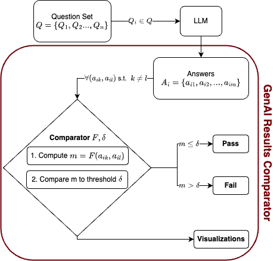

# GenAIResultsComparator

_GenAIResultsComparator_ is a Python library for evaluation metrics to
compare generated texts with their ground truth versions.
This library is particularly useful for evaluating outputs generated by
Large Language Models (LLM).

## Quick Start

Let's demonstrate the usage of the library with a simple example on the Recipie dataset.
_Detailed examples can be found in the [examples](examples) folder._

```python
from typing import Dict, Any
import json
from llm_metrics.semantic_similarity_metrics import BERTScore
from examples.llm_aware_metrics.code.prompt_aware import PromptAwareMetric

# Load the Recipe dataset
def load_recipe_data(file_path: str) -> Dict[str, Any]:
    """Load recipe conversion data from JSON file."""
    with open(file_path, 'r') as f:
        return json.load(f)

# Load our recipe data; Check details under `examples/llm_aware_metrics` folder
data = load_recipe_data('./examples/data/R3_conversion_1-shot-0.3.json')

# Initialize the metric
bert_score = BERTScore()
prompt_metric = PromptAwareMetric(bert_score)

# 2. Prompt-aware evaluation
prompt_score = prompt_metric.calculate_with_prompt(
    text1=data["response"],
    text2="",  # Placeholder empty string for comparison
    prompt1=data["system-prompt"],
    prompt2=data["prompt"],
)

print(f"Prompt-aware score: {prompt_score}")
```

Output:

```shell
> Prompt-aware score: {'precision': 0.5313692688941956, 'recall': 0.4975050091743469, 'f1': 0.5138798356056213}
```

Using `BERTScore` as the base metric, we get three scores:

- Precision: 0.53 - How much of the LLM's output is relevant
- Recall: 0.50 - How much of the expected content is captured
- F1: 0.51 - Harmonic mean of precision and recall

These scores indicate that:

- The LLM captured about 50% of the expected content
- There's a good balance between precision and recall
- The model understood the basic recipe structure but missed some details

## Description

The library provides a set of metrics for evaluating **2 text strings as inputs**. **Outputs are on a scale of 0 to 1** (normalized), where 1 indicates a perfect match between the two texts.

**_Class Structure:_** All metrics are implemented as classes, and they can be easily extended to add new metrics. The metrics start with the `BaseMetric` class under the `llm_metrics/base.py` file.

Each metric class inherits from this base class and is implemented with **two required methods**:

- `calculate()`: Computes the metric for a single pair of texts
- `batch_calculate()`: Efficiently processes multiple pairs of texts using vectorized operations and batch processing

**_Note:_** While the library can be used to compare strings, and we demonstrate this in the examples below, it's main purpose is to be used with generated texts from LLMs. An example of this can be found in the [examples/llm_aware_metrics](examples/llm_aware_metrics) folder.

**_Inspiration_** for the library and evaluation metrics was taken from [Microsoft's
article on evaluating LLM-generated content](https://learn.microsoft.com/en-us/ai/playbook/technology-guidance/generative-ai/working-with-llms/evaluation/list-of-eval-metrics). In the article, Microsoft describes 3 categories of evaluation metrics: **(1)** Reference-based metrics, **(2)** Reference-free metrics, and **(3)** LLM-based metrics. _The library currently supports reference-based metrics._

### Workflow

<p align="center">
  
</p>
<p align="center">
  <em>Overview of the workflow supported by the <i>GenAIResultsComparator</i> library</em>
</p>

## Table of Contents

- [Features](#features)
- [Installation](#installation)
- [Project Structure](#project-structure)
- [Development](#development)
- [Contributing](#contributing)
- [License](#license)
- [Acknowledgments](#acknowledgments)
- [Contact](#contact)

## Features

- Implements various metrics for text comparison:
  - N-gram-based metrics (BLEU, ROUGE, JS divergence)
  - Text similarity metrics (Jaccard, Cosine, Levenshtein)
  - Semantic similarity metrics (BERTScore)
- Supports batch processing for efficient computation
- Optimized for different input types (lists, numpy arrays, pandas Series)
- Extendable architecture for easy addition of new metrics
- Testing suite

## Installation

Currently, LLM Metrics is not available on PyPI. To use it, you'll need to clone the repository and set up the environment using UV.

1. First, make sure you have UV installed. If not, you can install it by following the instructions on the [official UV website](https://docs.astral.sh/uv/#installation).

2. Clone the repository:

   ```shell
   git clone https://github.com/ai4society/GenAIResultsComparator.git
   cd GenAIResultsComparator
   ```

3. Ensure the dependencies are installed by creating a virtual env. (python 3.12 is recommended):

   ```shell
   uv venv
   uv sync
   ```

4. (Optional) Activate the virtual environment (doing this avoids prepending `uv run` to any proceeding commands):
   ```shell
   source .venv/bin/activate
   ```

_If you don't want to use `uv`,_ you can install the dependencies with the following commands:

```shell
python3 -m venv .venv
source .venv/bin/activate
pip install -r requirements.txt
```

However note that the `requirements.txt` is generated automatically with the pre-commit file and might not include all the dependencies (in such case, a manual pip install might be needed).

Now you're ready to use LLM Metrics!

## Project Structure

The project structure is as follows:

```shell
.
├── README.md
├── LICENSE
├── .gitignore
├── uv.lock
├── pyproject.toml
├── .pre-commit-config.yaml
├── llm_metrics/  # Contains the library code
├── examples/     # Contains example scripts
└── tests/        # Contains test scripts
```

### Code Style

We use `pre-commit` hooks to maintain code quality and consistency. The configuration for these hooks is in the `.pre-commit-config.yaml` file. These hooks run automatically on `git commit`, but you can also run them manually:

```
pre-commit run --all-files
```

Our pre-commit hooks include:

- Code formatting with Black
- Import sorting with isort
- Linting with flake8
- Type checking with mypy

## Running Tests

Navigate to the project root in your terminal and run:

```bash
uv run pytest
```

Or, for more verbose output:

```bash
uv run pytest -v
```

To run only the slow BERTScore tests:

```bash
uv run pytest -m bertscore
```

To skip the slow BERTScore tests:

```bash
uv run pytest -m "not bertscore"
```

## Contributing

Contributions are welcome! Please feel free to submit a Pull Request.

1. Fork the repository
2. Create your feature branch (`git checkout -b feature/FeatureName`)
3. Commit your changes (`git commit -m 'Add some FeatureName'`)
4. Push to the branch (`git push origin feature/FeatureName`)
5. Open a Pull Request

Please ensure that your code passes all tests and adheres to our code style guidelines (enforced by pre-commit hooks) before submitting a pull request.

## Acknowledgments

- This library uses several open-source packages including NLTK, scikit-learn, and others.
- Special thanks to the creators and maintainers of the implemented metrics.

## License

This project is licensed under the MIT License - see the [LICENSE](LICENSE) file for details.

## Contact

If you have any questions, feel free to reach out to us at [ai4societyteam@gmail.com](mailto:ai4societyteam@gmail.com).
